# CvkeHarness Architecture

This document maps the current architecture of CvkeHarness as implemented in the repository on 2026-04-20.

It focuses on:

1. The command surface and package boundaries.
2. The end-to-end `run` lifecycle.
3. The persistence model across config, memory files, SQLite, and telemetry.
4. The separate safety evaluation flows.

## Repository Shape

| Package / Area | Responsibility |
| --- | --- |
| `main.go` | Thin executable entrypoint that delegates to Cobra. |
| `cmd/` | CLI surface: setup/settings wizard, runtime execution, memory/model/command admin, safety commands. |
| `agent/` | Main orchestration loop for routed planning, execution, and memory curation. |
| `core/` | Shared domain types for phases, routing, task classes, and retrieval context. |
| `provider/` | Provider abstraction plus concrete OpenRouter and LM Studio adapters. |
| `router/` | Historical model routing based on SQLite-backed model statistics and approval state. |
| `tools/` | Tool registry, shell execution guardrails, and ad hoc memory recording tool. |
| `memory/` | Readable markdown memory files, retrieval ranking, lesson persistence, promotion, snapshots, rollback. |
| `state/` | SQLite persistence for runs, phases, tool outcomes, routing candidates, approvals, memory metadata, snapshots. |
| `safety/` | Deterministic scorecard generation and live red-team harness. |
| `internal/httputil` | Shared HTTP client with timeout and retry/backoff. |
| `internal/log` | Structured logging wrapper around `slog`. |
| `internal/telemetry` | JSONL execution telemetry with secret masking. |

## Detailed Component Diagram

```mermaid
flowchart TB
    user["User / Terminal"]
    main["main.go\ncmd.Execute()"]
    root["cmd/root.go\nCobra root command"]

    subgraph CLI["CLI Command Surface (`cmd/`)"]
        setup["setup / settings\nInteractive wizard"]
        run["run [task]\nPrimary agent runtime"]
        memoryCmd["memory show|rollback|reindex"]
        modelsCmd["models shortlist|approve|stats"]
        commandsCmd["commands list|approve"]
        scorecardCmd["scorecard\nDeterministic safety analysis"]
        redteamCmd["redteam\nLive adversarial eval"]
    end

    subgraph ConfigLayer["Configuration and Bootstrap"]
        configPkg["config.Config\nLoadConfig / Save / DefaultConfig"]
        configFile["~/.cvkeharness/config.yaml"]
        providerResolver["providerFromConfig + providerResolver"]
        routingCfg["routingConfigFromConfig\nApproved models + phase defaults + thresholds"]
    end

    subgraph Runtime["Primary Runtime (`cvkeharness run`)"]
        agent["agent.Agent"]
        classify["core.ClassifyTask\nTask class inference"]
        phases["Phases\nplanning -> execution -> memory_curation"]
        chatState["agent.ChatState\nMutable message history"]
        systemStack["System prompt stack\nBuilt-in rules\noperator.md\nsoul.md\nlearned context\nplanning notes"]
    end

    subgraph Routing["Routing (`router/`)"]
        router["router.Router"]
        phaseDefaults["Default or per-phase model"]
        shortlist["Historical candidates\nscore = success - denials - latency penalty"]
        approvalPrompt["Terminal approval prompt\nfor unapproved recommendations"]
    end

    subgraph Providers["Provider Layer (`provider/`)"]
        providerIface["provider.Provider\nChatCompletion(ctx, request)"]
        openrouter["provider.OpenRouter"]
        lmstudio["provider.LMStudio"]
        httpClient["internal/httputil.Client\nTimeout + retry/backoff"]
        remoteLLM["Remote / local LLM endpoint"]
    end

    subgraph Tooling["Tooling (`tools/`)"]
        registry["tools.Registry"]
        toolDefs["Provider tool schemas"]
        shellTool["ShellTool\nshell_execute"]
        memoryTool["MemoryRecordFindingTool\nmemory_record_finding"]
        parser["ParseShellCommand\nsyntax segmentation"]
        allowlist["Static allowlist\nconfig.allowed_commands"]
        learnedApprovals["Learned command approvals\nfrom SQLite"]
        approver["ShellApprover\nLLM judge or user confirm"]
        hostShell["Host shell\nsh -c"]
    end

    subgraph Memory["Readable Memory (`memory/`)"]
        manager["memory.Manager"]
        ensureFiles["EnsureFiles\nseed files + snapshots dir"]
        retrieve["Retrieve / lookupEntries / scoreEntries"]
        persist["PersistLessons / promoteRepeatedLessons"]
        reindex["Reindex / parseManagedFiles"]
        operatorFile["operator.md"]
        soulFile["soul.md"]
        memoryFile["memory.md"]
        findingsFile["findings.md"]
        snapshotsDir["snapshots/"]
    end

    subgraph State["Structured State (`state/`)"]
        store["state.Store\nSQLite wrapper with graceful degradation"]
        runsTable["runs"]
        phasesTable["phase_records"]
        toolsTable["tool_outcomes"]
        statsTable["model_stats"]
        routingTable["routing_candidates"]
        modelApprovalTable["model_approvals"]
        commandApprovalTable["command_approvals"]
        memoryTable["memory_entries"]
        snapshotsTable["snapshots"]
        sqlite["~/.cvkeharness/state.db"]
    end

    subgraph Observability["Observability"]
        slog["internal/log\nstructured runtime logs"]
        telemetry["internal/telemetry\ntelemetry.jsonl"]
    end

    subgraph Safety["Safety Evaluation Flows (`safety/`)"]
        scorecard["GenerateScorecard\nstatic corpus against shell policy"]
        redteam["RedTeamHarness\nshadow shell tool + live model"]
        reports["docs/*.md + docs/*.json"]
    end

    user --> main --> root
    root --> setup
    root --> run
    root --> memoryCmd
    root --> modelsCmd
    root --> commandsCmd
    root --> scorecardCmd
    root --> redteamCmd

    setup --> configPkg
    setup --> providerResolver
    setup --> ensureFiles
    configPkg <--> configFile

    run --> configPkg
    run --> providerResolver
    run --> routingCfg
    run --> store
    run --> manager
    run --> registry
    run --> router
    run --> agent
    run --> slog

    routingCfg --> configPkg
    routingCfg --> store
    providerResolver --> openrouter
    providerResolver --> lmstudio

    openrouter --> providerIface
    lmstudio --> providerIface
    providerIface --> httpClient --> remoteLLM

    agent --> classify
    agent --> phases
    agent --> chatState
    agent --> systemStack
    agent --> router
    agent --> registry
    agent --> manager
    agent --> store
    agent --> providerIface

    router --> phaseDefaults
    router --> shortlist
    router --> approvalPrompt
    shortlist --> store
    approvalPrompt --> user

    registry --> toolDefs
    registry --> shellTool
    registry --> memoryTool
    shellTool --> parser
    shellTool --> allowlist
    shellTool --> learnedApprovals
    shellTool --> approver
    shellTool --> hostShell
    learnedApprovals --> store
    approver --> providerIface
    approver --> user
    shellTool --> telemetry

    manager --> ensureFiles
    manager --> retrieve
    manager --> persist
    manager --> reindex
    retrieve --> operatorFile
    retrieve --> soulFile
    retrieve --> memoryFile
    retrieve --> findingsFile
    retrieve --> store
    persist --> findingsFile
    persist --> memoryFile
    persist --> snapshotsDir
    persist --> store
    reindex --> memoryFile
    reindex --> findingsFile
    reindex --> store

    store --> runsTable
    store --> phasesTable
    store --> toolsTable
    store --> statsTable
    store --> routingTable
    store --> modelApprovalTable
    store --> commandApprovalTable
    store --> memoryTable
    store --> snapshotsTable
    runsTable --> sqlite
    phasesTable --> sqlite
    toolsTable --> sqlite
    statsTable --> sqlite
    routingTable --> sqlite
    modelApprovalTable --> sqlite
    commandApprovalTable --> sqlite
    memoryTable --> sqlite
    snapshotsTable --> sqlite

    scorecardCmd --> scorecard --> reports
    scorecard --> registry
    scorecard --> allowlist

    redteamCmd --> redteam
    redteam --> providerIface
    redteam --> agent
    redteam --> reports
```



## End-to-End Runtime Sequence For `cvkeharness run`

```mermaid
sequenceDiagram
    participant U as User
    participant C as cmd/run.go
    participant CFG as config.Config
    participant S as state.Store
    participant M as memory.Manager
    participant T as tools.Registry
    participant R as router.Router
    participant A as agent.Agent
    participant P as provider.Provider
    participant SH as ShellTool
    participant DB as state.db
    participant MEM as *.md memory files
    participant TEL as telemetry.jsonl

    U->>C: cvkeharness run "task"
    C->>CFG: LoadConfig()
    C->>S: Open(state.db)
    C->>M: NewManager(memoryDir, store)
    C->>M: EnsureFiles()
    C->>M: Reindex()
    M->>MEM: Parse memory.md + findings.md
    M->>DB: SyncMemoryEntries(...)
    C->>T: NewDefaultRegistryWithStoreAndMemory(...)
    T->>DB: ListCommandApprovals()
    C->>R: New(routingConfigFromConfig(cfg, store))
    C->>A: New(Options{provider, router, memory, tools, store})
    C->>A: Run(task)

    A->>A: ClassifyTask(task)

    alt Routing enabled
        A->>R: Select(planning, taskClass)
        R->>DB: ListModelStats(planning, taskClass, "")
        opt Top candidate unapproved and confident
            R->>U: Prompt for one-off model approval
            U-->>R: yes / no
            R->>DB: SaveModelApproval(approved_once)
        end
        A->>M: Retrieve(planning context)
        M->>MEM: Read operator.md + soul.md
        M->>DB: ListMemoryEntries(...)
        A->>P: ChatCompletion(plan prompt)
        P-->>A: 3-step planning notes
    end

    A->>R: Select(execution, taskClass, toolset)
    R->>DB: ListModelStats(execution, taskClass, toolset)
    A->>M: Retrieve(execution context)
    M->>MEM: Read operator.md + soul.md
    M->>DB: ListMemoryEntries(...) or parse fallback files
    A->>A: Build system prompt stack
    loop Up to MaxIterations
        A->>P: ChatCompletion(messages + tool defs)
        P-->>A: assistant message and optional tool calls
        alt No tool calls
            A-->>C: Final response
        else Tool calls returned
            loop For each tool call
                A->>T: ExecuteTool(call)
                alt shell_execute
                    T->>SH: Execute(arguments)
                    SH->>SH: ParseShellCommand / validate allowlist
                    opt Not auto-approved
                        SH->>P: LLM judge approval
                        or
                        SH->>U: Manual confirm approval
                        SH->>DB: SaveCommandApproval(...)
                    end
                    SH->>TEL: RecordEvent(...)
                    SH-->>T: stdout/stderr or error
                else memory_record_finding
                    T->>M: PersistLessons(single finding)
                    M->>MEM: Update findings.md
                    M->>DB: SaveMemoryEntries(...)
                    M->>MEM: Promote repeats into memory.md
                end
                T-->>A: Tool result
                A->>A: Append tool result to ChatState
            end
            opt Policy denial or repeated tool failure, once per run
                A->>M: Retrieve(refreshed context with Trouble metadata)
                M-->>A: Refreshed learned snippets
                A->>A: Inject extra system note
            end
        end
    end

    A->>A: Build heuristic lessons from tool outcomes / errors
    alt Routing enabled and curator available
        A->>R: Select(memory_curation, taskClass)
        R->>DB: ListModelStats(memory_curation, taskClass, "")
        A->>M: Retrieve(curation context)
        A->>P: ChatCompletion(JSON lesson prompt)
        P-->>A: JSON lessons
    end

    A->>M: PersistLessons(curated or heuristic lessons)
    M->>MEM: Snapshot + rewrite findings.md / memory.md
    M->>DB: SaveMemoryEntries(...)
    A->>S: RecordRun(run record + phases + tools)
    S->>DB: Insert runs / phase_records / tool_outcomes
    S->>DB: Upsert model_stats
    C-->>U: Print result and optional routing explanation
```

## Runtime Responsibilities By Layer

### 1. CLI and bootstrap

- `main.go` is intentionally thin and hands control to Cobra.
- `cmd/root.go` initializes default logging in `PersistentPreRun`.
- `cmd/run.go` is the composition root for the main runtime.
- `cmd/runtime_support.go` converts persisted config into provider and routing objects.
- `cmd/setup.go` and `cmd/setup_soul.go` form a full-screen setup wizard that:
  - selects the provider,
  - validates OpenRouter keys or captures LM Studio base URLs,
  - fetches model lists from provider APIs,
  - configures safety mode, routing, token/iteration limits, and logging,
  - writes `config.yaml`,
  - bootstraps `soul.md` plus other memory files.

### 2. Agent orchestration

The `agent.Agent` is the core coordinator. It is intentionally dependency-inverted:

- providers are passed in through the `provider.Provider` interface,
- routing is passed in through the `Router` interface,
- memory access is split into `MemoryRetriever` and `MemoryCurator`,
- run persistence is abstracted behind `RunRecorder`,
- tools are centralized through `tools.Registry`.

This keeps the agent package focused on control flow rather than storage or network specifics.

The agent has three conceptual phases:

1. `planning`
2. `execution`
3. `memory_curation`

Only the execution phase is iterative and tool-using. Planning and curation are single model calls.

### 3. Prompt assembly and context shaping

Prompt construction is layered rather than monolithic. `memory.Manager.Retrieve()` returns:

- built-in invariant rules,
- `operator.md`,
- `soul.md`,
- ranked learned snippets from `memory.md` / `findings.md`.

`agent.initialSystemMessages()` then stacks those pieces into ordered `system` messages and optionally appends planning notes during execution.

This is an important architecture choice: the runtime treats human-managed instructions and machine-curated lessons as separate inputs instead of flattening everything into one mutable file.

### 4. Routing model selection

`router.Router` performs history-based model selection per phase.

Inputs:

- current phase,
- task class,
- toolset key,
- approved model set,
- minimum confidence threshold,
- optional per-phase defaults.

Source of evidence:

- `state.model_stats` aggregates created from prior runs.

Behavior:

- if routing is disabled, use defaults;
- if routing history is absent or low confidence, use defaults;
- if the best candidate is approved and confident, select it automatically;
- if the best candidate is strong but unapproved, ask for one-off approval and persist that decision.

This gives the runtime a constrained learning loop: it can adapt, but only within explicit approval boundaries.

### 5. Tool execution model

The registry currently exposes:

- `shell_execute`
- `memory_record_finding`

`shell_execute` is the most security-sensitive path in the codebase. Its architecture is layered:

1. Parse and segment the shell command.
2. Reject unsupported syntax such as pipes, redirects, command substitution, and malformed chaining.
3. Validate each segment against:
   - the static allowlist from config,
   - previously approved normalized segments from SQLite.
4. If validation fails, defer to a secondary approval gate:
   - LLM-as-a-judge, or
   - direct user confirmation.
5. Persist newly approved segments for reuse.
6. Execute through `sh -c` with timeout.
7. Record telemetry with approval mode and outcome.

The memory tool is much narrower: it writes reusable findings into `findings.md` through the same lesson pipeline used by agent curation.

### 6. Readable memory plus structured memory metadata

The memory subsystem has a dual representation by design.

Readable files in `~/.cvkeharness/`:

- `operator.md`
- `soul.md`
- `memory.md`
- `findings.md`

Structured SQLite metadata:

- indexed memory entries,
- status flags,
- scope metadata,
- timestamps,
- snapshot references.

This split allows:

- user-editable, readable prompts,
- fast scoped retrieval and ranking,
- durable promotion logic,
- rollback through snapshots.

The promotion rule is simple and pragmatic:

- new lessons land in `findings.md`,
- repeated normalized lessons are promoted to `memory.md`,
- if the same lesson appears across multiple models, it can be promoted as `global`.

### 7. State database

`state.Store` is more than a run log. It is the shared machine memory for several subsystems:

- runtime observability through `runs`, `phase_records`, and `tool_outcomes`,
- adaptive routing through `model_stats` and `routing_candidates`,
- approval memory through `model_approvals` and `command_approvals`,
- memory indexing through `memory_entries`,
- rollback support through `snapshots`.

An important resilience detail: the store degrades to an unavailable/no-op style if SQLite cannot be opened. The CLI warns and continues with file-backed memory fallback where possible.

### 8. Provider abstraction and HTTP behavior

The provider package intentionally exposes one small interface:

`ChatCompletion(ctx, *ChatRequest) -> *ChatResponse`

Both OpenRouter and LM Studio implement this same contract using OpenAI-style chat payloads with tool definitions.

Shared HTTP behavior comes from `internal/httputil.Client`:

- request timeout,
- limited retry count,
- exponential backoff,
- retry on 429 and 5xx.

This keeps network semantics consistent across providers.

### 9. Safety evaluation architecture

There are two distinct safety paths:

#### `scorecard`

- deterministic,
- no live model needed,
- evaluates a fixed shell corpus against `tools.ValidateAllowedShellCommand`,
- measures breakout blocking, diagnostic allowance, and tool inventory risk posture,
- writes JSON and Markdown reports.

#### `redteam`

- live model-driven evaluation,
- uses a shadow registry with a simulated shell tool,
- records what the model attempts,
- classifies attempts by severity and disposition,
- writes JSON and Markdown reports.

The red-team harness deliberately reuses `agent.Agent`, which means the safety workflow exercises the same iterative tool-calling loop as the production runtime.

## Key Architectural Strengths

- Clear composition root in `cmd/run.go`.
- Good separation between orchestration, routing, tools, memory, persistence, and providers.
- Dual memory design balances human readability with machine retrieval.
- Routing is adaptive but still approval-bounded.
- Shell execution is guarded by both syntax restrictions and approval workflows.
- Safety tooling is first-class rather than bolted on.
- SQLite-backed stats make learning and auditability possible without introducing external infrastructure.

## Notable Constraints and Tradeoffs

- The current tool surface is intentionally small, so the system is more shell-centric than domain-tool-centric.
- Safety and approval logic are primarily concentrated around shell usage; other future mutating tools would need equivalent policy treatment.
- The setup wizard directly fetches provider model lists and owns a lot of UI logic in one file, which is practical but monolithic.
- Routing depends on enough historical samples per phase/task/tool profile; cold-start behavior always falls back to defaults.
- Memory retrieval DB queries currently emphasize one tool name at a time during lookup, which is simple but may underuse multi-tool context.

## Practical Mental Model

CvkeHarness is best understood as a local-first, CLI-hosted agent runtime with five cooperating loops:

1. A bootstrap loop that turns user choices into config and prompt files.
2. An execution loop that alternates model reasoning and tool calls.
3. A routing loop that learns which approved model tends to work best for each phase/profile.
4. A memory loop that turns repeated lessons into durable reusable guidance.
5. A safety loop that continuously tests whether the shell/tool boundary still behaves as intended.

That combination is what gives the codebase its character: it is not just a single agent loop, but a small self-observing runtime around that loop.
