# CvkeHarness Architecture

This document maps the current architecture of CvkeHarness as implemented in the repository on 2026-04-22.

It focuses on:

1. the command surface and package boundaries
2. the end-to-end `run` lifecycle
3. the target-aware memory subsystem
4. the persistence model across config, markdown, SQLite, and telemetry
5. the separate safety evaluation flows

## Repository Shape

| Package / Area | Responsibility |
| --- | --- |
| `main.go` | Thin executable entrypoint that delegates to Cobra. |
| `cmd/` | CLI surface: setup/settings wizard, runtime execution, chat, memory/model/command admin, safety commands. |
| `agent/` | Main orchestration loop for routed planning, execution, chat, and deterministic memory curation. |
| `core/` | Shared domain types for phases, routing, task classes, model refs, and retrieval context. |
| `provider/` | Provider abstraction plus concrete Codex ChatGPT, OpenRouter, OpenAI, and LM Studio adapters. |
| `router/` | Historical model routing based on SQLite-backed model statistics and approval state. |
| `tools/` | Tool registry, shell execution guardrails, and ad hoc memory recording tool. |
| `memory/` | Target-aware readable memory files, target resolution, retrieval brief rendering, deterministic curation, reindex, rollback. |
| `state/` | SQLite persistence for runs, phases, tool outcomes, routing candidates, approvals, operational memory tables, snapshots, and chat history. |
| `safety/` | Deterministic scorecard generation and live red-team harness. |
| `internal/httputil` | Shared HTTP client with timeout and retry/backoff. |
| `internal/log` | Structured logging wrapper around `slog`. |
| `internal/telemetry` | JSONL execution telemetry with secret masking. |

## Detailed Component Diagram

```mermaid
flowchart TB
    user["User / Terminal"]
    main["main.go\ncmd.Execute()"]
    root["cmd/root.go\nCobra root command"]

    subgraph CLI["CLI Command Surface (`cmd/`)"]
        setup["setup / settings\nInteractive wizard"]
        run["run [task]\nPrimary agent runtime"]
        chat["chat\nInteractive session"]
        memoryCmd["memory show|rollback|reindex"]
        modelsCmd["models shortlist|approve|stats"]
        commandsCmd["commands list|approve"]
        scorecardCmd["scorecard\nDeterministic safety analysis"]
        redteamCmd["redteam\nLive adversarial eval"]
    end

    subgraph ConfigLayer["Configuration and Bootstrap"]
        configPkg["config.Config\nLoadConfig / Save / Normalize"]
        configFile["~/.cvkeharness/config.yaml"]
        providerResolver["providerFromConfig + providerResolver"]
        routingCfg["routingConfigFromConfig\nApproved models + phase defaults + thresholds"]
    end

    subgraph Runtime["Primary Runtime"]
        agent["agent.Agent"]
        classify["core.ClassifyTask\nTask class inference"]
        resolve["memory.Manager.ResolveTarget\nruntime host vs active target"]
        retrieve["memory.Manager.RetrievePlan\ncompact retrieval brief"]
        curate["memory.Manager.CurateRunOutcome\ndeterministic persistence"]
        chatState["agent.ChatState\nMutable message history"]
    end

    subgraph Routing["Routing (`router/`)"]
        router["router.Router"]
        phaseDefaults["Default or per-phase model"]
        shortlist["Historical candidates\nscore = success - denials - latency penalty"]
        approvalPrompt["Terminal approval prompt\nfor unapproved recommendations"]
    end

    subgraph Providers["Provider Layer (`provider/`)"]
        providerIface["provider.Provider\nChatCompletion(ctx, request)"]
        codex["provider.Codex\nChatGPT subscription auth"]
        openrouter["provider.OpenRouter"]
        openai["provider.OpenAI"]
        lmstudio["provider.LMStudio"]
        httpClient["internal/httputil.Client\nTimeout + retry/backoff"]
        remoteLLM["Remote or local LLM endpoint"]
    end

    subgraph Tooling["Tooling (`tools/`)"]
        registry["tools.Registry"]
        shellTool["ShellTool\nshell_execute"]
        memoryTool["MemoryRecordFindingTool\nmemory_record_finding"]
        parser["ParseShellCommand\nsyntax segmentation"]
        allowlist["Static allowlist\nconfig.allowed_commands"]
        learnedApprovals["Learned command approvals\nfrom SQLite"]
        approver["ShellApprover\nLLM judge or user confirm"]
        hostShell["Host shell\nsh -c"]
    end

    subgraph Memory["Readable Operational Memory (`memory/`)"]
        manager["memory.Manager"]
        ensureFiles["EnsureFiles\nbootstrap files + snapshots dir"]
        resolveTarget["ResolveTarget\nregistry + alias merge"]
        retrievePlan["RetrievePlan\nruntime summary + target summary + playbook + caution + finding"]
        curateOutcome["CurateRunOutcome\nfacts + playbooks + cautions + findings"]
        reindex["Reindex / parse managed markdown files"]
        guidanceFile["guidance.md"]
        targetsFile["targets.md"]
        playbooksFile["playbooks.md"]
        findingsFile["findings.md"]
        cautionsFile["cautions.md"]
        snapshotsDir["snapshots/"]
    end

    subgraph State["Structured State (`state/`)"]
        store["state.Store\nSQLite wrapper with graceful degradation"]
        runsTable["runs / phase_records / tool_outcomes"]
        statsTable["model_stats / routing_candidates"]
        approvalsTable["model_approvals / command_approvals"]
        targetsTable["targets / target_aliases"]
        factsTable["host_facts"]
        playbooksTable["playbooks"]
        findingsTable["findings"]
        cautionsTable["cautions"]
        snapshotsTable["snapshots"]
        chatsTable["chat_sessions / chat_turns / chat_messages"]
        sqlite["~/.cvkeharness/state.db"]
    end

    subgraph Observability["Observability"]
        slog["internal/log\nstructured runtime logs"]
        telemetry["internal/telemetry\ntelemetry/live/events.jsonl + SQLite projections"]
    end

    subgraph Safety["Safety Evaluation Flows (`safety/`)"]
        scorecard["GenerateScorecard\nstatic corpus against shell policy"]
        redteam["RedTeamHarness\nshadow shell tool + live model"]
        reports["docs/*.md + docs/*.json"]
    end

    user --> main --> root
    root --> setup
    root --> run
    root --> chat
    root --> memoryCmd
    root --> modelsCmd
    root --> commandsCmd
    root --> scorecardCmd
    root --> redteamCmd

    setup --> configPkg
    setup --> providerResolver
    setup --> ensureFiles
    configPkg <--> configFile

    run --> configPkg
    run --> providerResolver
    run --> routingCfg
    run --> store
    run --> manager
    run --> registry
    run --> router
    run --> agent
    run --> slog

    chat --> configPkg
    chat --> providerResolver
    chat --> routingCfg
    chat --> store
    chat --> manager
    chat --> registry
    chat --> router
    chat --> agent

    routingCfg --> configPkg
    routingCfg --> store
    providerResolver --> codex
    providerResolver --> openrouter
    providerResolver --> openai
    providerResolver --> lmstudio

    codex --> providerIface
    openrouter --> providerIface
    openai --> providerIface
    lmstudio --> providerIface
    providerIface --> httpClient --> remoteLLM

    agent --> classify
    agent --> resolve
    agent --> retrieve
    agent --> curate
    agent --> chatState
    agent --> router
    agent --> registry
    agent --> manager
    agent --> store
    agent --> providerIface

    router --> phaseDefaults
    router --> shortlist
    router --> approvalPrompt
    shortlist --> store
    approvalPrompt --> user

    registry --> shellTool
    registry --> memoryTool
    shellTool --> parser
    shellTool --> allowlist
    shellTool --> learnedApprovals
    shellTool --> approver
    shellTool --> hostShell
    learnedApprovals --> store
    approver --> providerIface
    approver --> user
    shellTool --> telemetry

    manager --> ensureFiles
    manager --> resolveTarget
    manager --> retrievePlan
    manager --> curateOutcome
    manager --> reindex
    retrievePlan --> operatorFile
    retrievePlan --> soulFile
    retrievePlan --> targetsFile
    retrievePlan --> hostFile
    retrievePlan --> playbooksFile
    retrievePlan --> findingsFile
    retrievePlan --> cautionsFile
    retrievePlan --> store
    curateOutcome --> targetsFile
    curateOutcome --> hostFile
    curateOutcome --> playbooksFile
    curateOutcome --> findingsFile
    curateOutcome --> cautionsFile
    curateOutcome --> snapshotsDir
    curateOutcome --> store
    reindex --> targetsFile
    reindex --> hostFile
    reindex --> playbooksFile
    reindex --> findingsFile
    reindex --> cautionsFile
    reindex --> store

    store --> runsTable
    store --> statsTable
    store --> approvalsTable
    store --> targetsTable
    store --> factsTable
    store --> playbooksTable
    store --> findingsTable
    store --> cautionsTable
    store --> snapshotsTable
    store --> chatsTable
    runsTable --> sqlite
    statsTable --> sqlite
    approvalsTable --> sqlite
    targetsTable --> sqlite
    factsTable --> sqlite
    playbooksTable --> sqlite
    findingsTable --> sqlite
    cautionsTable --> sqlite
    snapshotsTable --> sqlite
    chatsTable --> sqlite

    scorecardCmd --> scorecard --> reports
    scorecard --> registry
    scorecard --> allowlist

    redteamCmd --> redteam
    redteam --> providerIface
    redteam --> agent
    redteam --> reports
```



## End-to-End Runtime Sequence For `cvkeharness run`

```mermaid
sequenceDiagram
    participant U as User
    participant C as cmd/run.go
    participant CFG as config.Config
    participant S as state.Store
    participant M as memory.Manager
    participant T as tools.Registry
    participant R as router.Router
    participant A as agent.Agent
    participant P as provider.Provider
    participant SH as ShellTool
    participant DB as state.db
    participant MEM as managed markdown files
    participant TEL as telemetry/live/events.jsonl

    U->>C: cvkeharness run "task"
    C->>CFG: LoadConfig()
    C->>S: Open(state.db)
    C->>M: NewManager(memoryDir, store)
    C->>M: EnsureFiles()
    C->>M: Reindex()
    M->>MEM: Parse targets.md, playbooks.md, findings.md, cautions.md
    M->>DB: ReplaceOperationalMemory(...)
    C->>T: NewDefaultRegistryWithStoreAndMemory(...)
    T->>DB: ListCommandApprovals()
    C->>R: New(routingConfigFromConfig(cfg, store))
    C->>A: New(Options{provider, router, memory, tools, store})
    C->>A: Run(task)

    A->>A: ClassifyTask(task)
    A->>M: ResolveTarget(task hint)

    alt Routing enabled
        A->>R: Select(planning, taskClass)
        R->>DB: ListModelStats(planning, taskClass, "")
        opt Top candidate unapproved and confident
            R->>U: Prompt for one-off model approval
            U-->>R: yes / no
            R->>DB: SaveModelApproval(approved_once)
        end
        A->>M: RetrievePlan(planning context)
        M->>MEM: Read guidance.md
        M->>DB: LoadOperationalMemory() or parse fallback files
        A->>P: ChatCompletion(plan prompt)
        P-->>A: concise planning notes
    end

    A->>R: Select(execution, taskClass, toolset)
    R->>DB: ListModelStats(execution, taskClass, toolset)
    A->>M: RetrievePlan(execution context)
    M->>MEM: Read guidance.md
    M->>DB: LoadOperationalMemory() or parse fallback files
    A->>A: Build system prompt stack

    loop Up to MaxIterations
        A->>P: ChatCompletion(messages + tool defs)
        P-->>A: assistant message and optional tool calls
        alt No tool calls
            A-->>C: Final response
        else Tool calls returned
            loop For each tool call
                A->>T: ExecuteTool(call)
                alt shell_execute
                    T->>SH: Execute(arguments)
                    SH->>SH: ParseShellCommand / validate allowlist
                    opt Not auto-approved
                        SH->>P: LLM judge approval
                        or
                        SH->>U: Manual confirm approval
                        SH->>DB: SaveCommandApproval(...)
                    end
                    SH->>TEL: RecordEvent(...)
                    SH-->>T: stdout/stderr or error
                    A->>M: ResolveTarget(observed shell command)
                else memory_record_finding
                    T->>M: PersistLessons(single finding)
                    M->>MEM: Update findings.md
                    M->>DB: ReplaceOperationalMemory(...)
                end
                T-->>A: Tool result
                A->>A: Append tool result to ChatState
            end
            opt Policy denial or repeated tool failure, once per run
                A->>M: RetrievePlan(refreshed context with Trouble metadata)
                M-->>A: Refreshed compact brief
                A->>A: Inject extra system note
            end
        end
    end

    A->>M: CurateRunOutcome(observed tool calls + target resolution + output)
    M->>MEM: Snapshot and rewrite managed files
    M->>DB: ReplaceOperationalMemory(...)
    A->>S: RecordRun(run record + phases + tools)
    S->>DB: Insert runs / phase_records / tool_outcomes
    S->>DB: Upsert model_stats
    C-->>U: Print result and optional routing explanation
```

## Runtime Responsibilities By Layer

### 1. CLI and bootstrap

- `main.go` is intentionally thin and hands control to Cobra.
- `cmd/root.go` initializes default logging in `PersistentPreRun`.
- `cmd/run.go` is the composition root for the main runtime.
- `cmd/chat.go` assembles the same runtime components for interactive work.
- `cmd/setup.go` and `cmd/setup_soul.go` form a full-screen setup wizard that:
  - selects the provider
  - validates Codex CLI ChatGPT login, OpenRouter/OpenAI credentials, or LM Studio base URLs
  - configures safety mode, routing, token/iteration limits, and logging
  - writes `config.yaml`
  - bootstraps `guidance.md` plus the structured memory files

### 2. Agent orchestration

The `agent.Agent` is the core coordinator and is intentionally dependency-inverted:

- providers come in through `provider.Provider`
- routing comes in through `Router`
- memory access is split into retrieval and curation interfaces
- run persistence is abstracted behind `RunRecorder`
- tools are centralized through `tools.Registry`

This keeps the agent package focused on control flow rather than storage or network specifics.

### 3. Prompt assembly and context shaping

Prompt construction is layered rather than monolithic.

`memory.Manager.RetrievePlan()` returns:

- built-in invariant rules
- compiled `guidance.md`
- runtime-host summary
- optional target summary
- optional primary playbook
- optional caution
- optional fallback finding

`agent.buildPromptPlan()` lays those pieces out as a stable prefix, stable tool policy, compact target brief, and volatile turn context.

This is a deliberate architecture choice: the runtime treats human-managed instructions and machine-curated operational knowledge as separate layers instead of flattening everything into one mutable memory file.

### 4. Routing model selection

`router.Router` performs history-based model selection per phase.

Inputs:

- current phase
- task class
- toolset key
- approved model set
- minimum confidence threshold
- optional per-phase defaults

Source of evidence:

- `state.model_stats` aggregates created from prior runs

Behavior:

- if routing is disabled, use defaults
- if routing history is absent or low confidence, use defaults
- if the best candidate is approved and confident, select it automatically
- if the best candidate is strong but unapproved, ask for one-off approval and persist that decision

### 5. Tool execution model

The registry currently exposes:

- `shell_execute`
- `memory_record_finding`
- optional `web_search` and `web_fetch` when Tavily web search is enabled and credentialed

`shell_execute` is the most security-sensitive path in the codebase. Its architecture is layered:

1. parse and segment the shell command
2. reject unsupported syntax such as redirects, command substitution, backgrounding, and malformed chaining
3. validate each segment against:
   - the static allowlist from config
   - previously approved normalized segments from SQLite
4. if validation fails, defer to a secondary approval gate:
   - LLM-as-a-judge, or
   - direct user confirmation
5. persist newly approved segments for reuse
6. execute through `sh -c` with timeout
7. record telemetry with approval mode and outcome

The memory note tool is intentionally narrower: it writes reusable ad hoc findings into `findings.md` through the same structured memory manager, but it does not create playbooks or cautions directly.

The optional web tools are read-only public research tools. They call Tavily directly over HTTP, return bounded structured JSON, reject obvious secrets, and prevent `web_fetch` from sending localhost, private, metadata, or internal-looking URLs to the external provider. Successful web-only output is not promoted into target-aware operational memory automatically.

### 6. Target-aware operational memory

The memory subsystem has a dual representation by design.

Readable files in `~/.cvkeharness/`:

- `guidance.md`
- `targets.md`
  Includes the runtime host as a normal target record.
- `playbooks.md`
- `findings.md`
- `cautions.md`

Structured SQLite metadata:

- target registry
- alias mapping
- verified host facts
- durable playbooks
- provisional findings
- cautions
- snapshots

This split allows:

- user-editable readable files
- fast scoped retrieval and ranking
- deterministic target resolution
- strict prompt budget enforcement
- rollback through snapshots

### 7. State database

`state.Store` is more than a run log. It is the shared machine memory for several subsystems:

- runtime observability through `runs`, `phase_records`, and `tool_outcomes`
- adaptive routing through `model_stats` and `routing_candidates`
- approval memory through `model_approvals` and `command_approvals`
- operational memory indexing through `targets`, `target_aliases`, `host_facts`, `playbooks`, `findings`, and `cautions`
- rollback support through `snapshots`
- chat history through `chat_sessions`, `chat_turns`, and `chat_messages`

An important resilience detail: the store degrades to an unavailable/no-op style if SQLite cannot be opened. The CLI warns and continues with file-backed memory fallback where possible.

### 8. Provider abstraction and HTTP behavior

The provider package intentionally exposes one small interface:

`ChatCompletion(ctx, *ChatRequest) -> *ChatResponse`

OpenRouter and LM Studio implement this contract with OpenAI-style chat payloads. The OpenAI adapter maps the same harness messages and tool calls onto the Responses API for usage-based API access, and the Codex provider reuses the official Codex CLI ChatGPT OAuth cache against the ChatGPT Codex backend.

Shared HTTP behavior comes from `internal/httputil.Client`:

- request timeout
- limited retry count
- exponential backoff
- retry on `429` and `5xx`

### 9. Safety evaluation architecture

There are two distinct safety paths.

#### `scorecard`

- deterministic
- no live model needed
- evaluates a fixed shell corpus against `tools.ValidateAllowedShellCommand`
- measures breakout blocking, diagnostic allowance, and tool inventory risk posture
- writes JSON and Markdown reports

#### `redteam`

- live model-driven evaluation
- uses a shadow registry with a simulated shell tool
- records what the model attempts
- classifies attempts by severity and disposition
- writes JSON and Markdown reports

The red-team harness deliberately reuses `agent.Agent`, which means the safety workflow exercises the same iterative tool-calling loop as the production runtime.

## Key Architectural Strengths

- clear composition roots in `cmd/run.go` and `cmd/chat.go`
- good separation between orchestration, routing, tools, memory, persistence, and providers
- target-aware memory balances human readability with deterministic retrieval
- routing is adaptive but still approval-bounded
- shell execution is guarded by both syntax restrictions and approval workflows
- safety tooling is first-class rather than bolted on
- SQLite-backed stats make learning and auditability possible without external infrastructure

## Notable Constraints and Tradeoffs

- the current tool surface is intentionally small, so the system is still shell-centric
- target discovery is driven mainly by prompt hints and observed shell commands rather than richer domain tools
- memory retrieval is intentionally narrow, which improves reliability but leaves some potentially useful context out of prompt
- routing still depends on enough historical samples per phase/task/tool profile
- the setup wizard still owns a lot of UI logic in one file, which is practical but monolithic

## Practical Mental Model

CvkeHarness is best understood as a local-first, CLI-hosted agent runtime with five cooperating loops:

1. a bootstrap loop that turns user choices into config and prompt files
2. an execution loop that alternates model reasoning and tool calls
3. a routing loop that learns which approved model tends to work best for each phase/profile
4. a target-aware memory loop that turns verified successes and failures into operational recall
5. a safety loop that continuously tests whether the shell boundary still behaves as intended

That combination is what gives the codebase its character: it is not just a single agent loop, but a small self-observing runtime around that loop.
