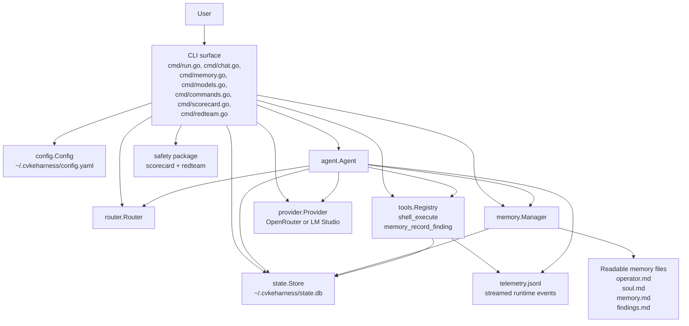
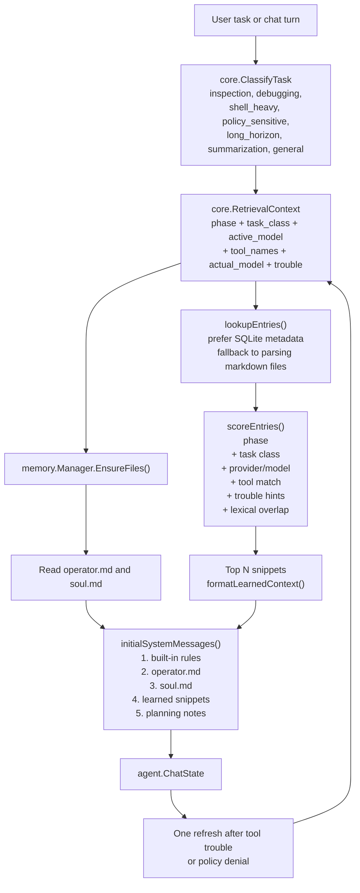
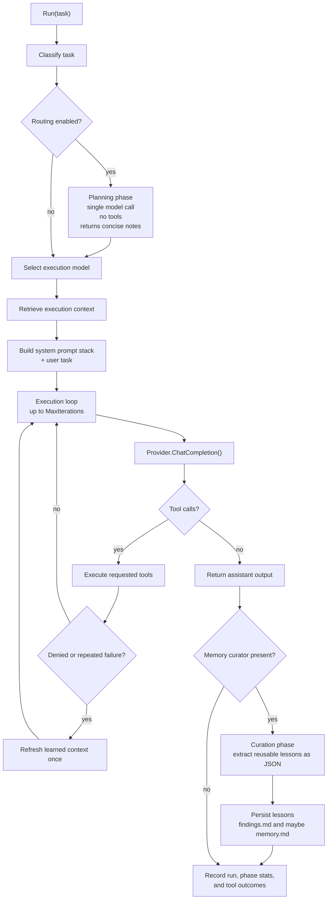
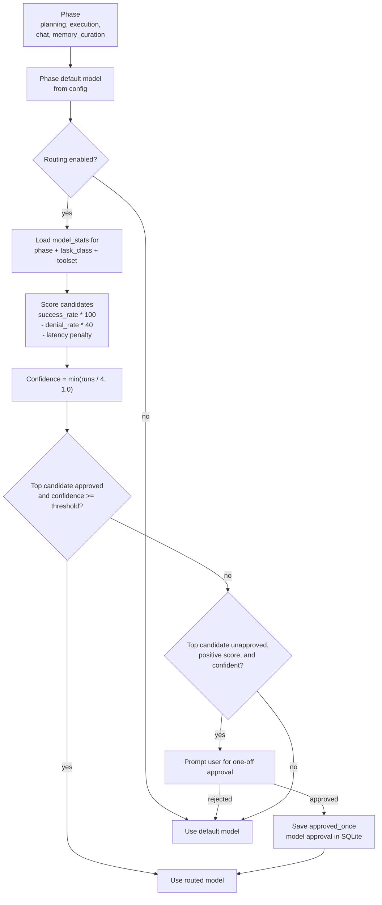
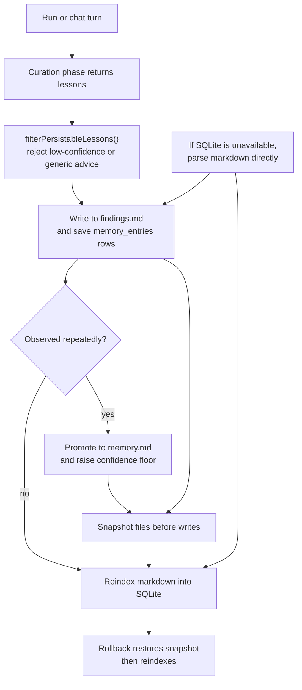
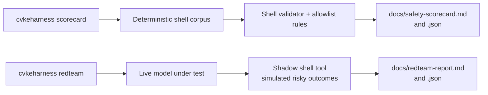

# CvkeHarness Visual Guide

This guide is a companion to `docs/architecture.md`.

It focuses on the parts of the project that matter most when you are trying to rebuild the mental model quickly:

- context management
- the agent loop
- model routing
- memory
- safety and evaluation

## 1. System At A Glance



Key idea: the CLI builds one runtime from config, provider, router, tool registry, memory manager, and SQLite state, then hands control to `agent.Agent`.

The runtime is intentionally split into two worlds:

- readable files for durable human understanding
- SQLite for scoring, approvals, indexing, chat history, and routing statistics

## 2. Context Management

The project does not build one giant prompt. It assembles context in layers and keeps the learned part small.



What is important here:

- `builtInRules()` is fixed runtime policy and keeps the baseline behavior stable.
- `operator.md` is the harness operating manual. It explains file roles, dependency handling, approval boundaries, and when the agent may write a finding.
- `soul.md` is the human-facing persona layer and is intentionally user-owned.
- learned context comes from `memory.md` and `findings.md`, but only the best-scoring snippets are injected.
- retrieval can use either the requested model or the actual served model, which matters when a provider alias resolves to a different concrete model.
- during execution or chat, the runtime allows one mid-run refresh if a tool is denied or the same tool keeps failing.

## 3. Agent Loop

`agent.Agent` is the center of gravity for the project.



A few implementation details are easy to miss but shape the runtime a lot:

- planning is optional and only runs when routing is enabled and a router exists
- planning uses an empty toolset profile on purpose, so route selection for planning is not biased by execution tools
- execution is iterative and tool-driven; the loop stops only when the model returns an assistant message with no tool calls
- curation is separated from execution so the model that acts does not also have to decide what becomes reusable memory
- all phase records and tool outcomes are folded back into `state.Store.RecordRun()`, which updates `model_stats`

## 4. Model Routing

Routing is local, heuristic, and approval-aware. It is not an unconstrained auto-router.



The route profile is more specific than just "best model overall". It keys off:

- phase
- task class
- toolset

That means a model can be preferred for execution on debugging tasks with `shell_execute`, while another model can still win for planning or chat.

Important boundary: unapproved models do not silently take over. The router can recommend them, but the user still has to approve a confident new candidate before the runtime switches.

## 5. Memory Lifecycle

Memory is deliberately split between provisional notes and durable memory.



The memory policy is more disciplined than "append everything forever":

- `findings.md` is the staging area for narrow reusable notes
- `memory.md` is reserved for durable lessons, often after repetition
- repeated lessons across multiple models can be promoted to global memory
- snapshots are taken before managed file writes, so rollback is a first-class workflow
- if SQLite fails, retrieval still works by parsing the Markdown files directly

In practice this gives the project a nice property: humans can read and edit the memory files, but the runtime still gets normalized metadata such as scope, confidence, recency, and seen counts.

## 6. Safety Model

Safety is not just one guard. It is a stack of boundaries around shell access plus separate evaluation commands.

```mermaid
flowchart TD
    call["Model requests shell_execute"]
    parse["ParseShellCommand()\nsegment command\nreject blocked syntax"]
    blocked["Blocked syntax\nredirection, substitution,\nbackticks, raw newlines,\nsingle &, malformed chains"]
    allow["Allowlist or learned\napproved segments?"]
    gate["Secondary approval gate"]
    judge["LLM judge\nSAFE or DANGEROUS"]
    user["User confirm\nreject, approve once,\napprove and remember"]
    remember["Persist approved segments\ninto command_approvals"]
    exec["Run sh -c with timeout\ncapture and stream output"]
    events["Emit structured events\nand telemetry"]

    call --> parse
    parse -- "invalid" --> blocked
    parse -- "valid" --> allow
    allow -- "yes" --> exec --> events
    allow -- "no" --> gate
    gate --> judge
    gate --> user
    judge --> remember
    user --> remember
    remember --> exec
```

The separate safety commands then evaluate those rails from two angles:



The practical split is:

- `scorecard` answers "what do the static rails allow or deny right now?"
- `redteam` answers "how does a real model behave when it actively tries to escape those rails?"

## 7. Practical Mental Model

If we compress the whole codebase into one sentence, it is this:

CvkeHarness is a phase-routed tool-using LLM runtime whose behavior is shaped by a layered prompt stack, a small local memory system, approval-aware safety rails, and SQLite-backed learning about what worked before.

If you want to re-enter the code quickly, this is the best reading order:

1. `cmd/run.go`
2. `agent/agent.go`
3. `memory/manager_retrieval.go`
4. `router/router.go`
5. `tools/shell.go`
6. `state/store.go`
7. `safety/scorecard.go` and `safety/redteam.go`
