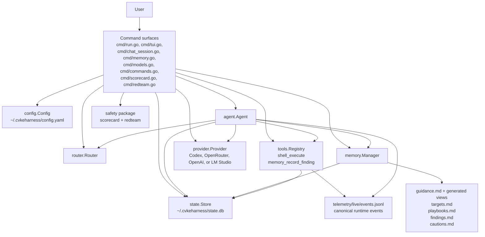
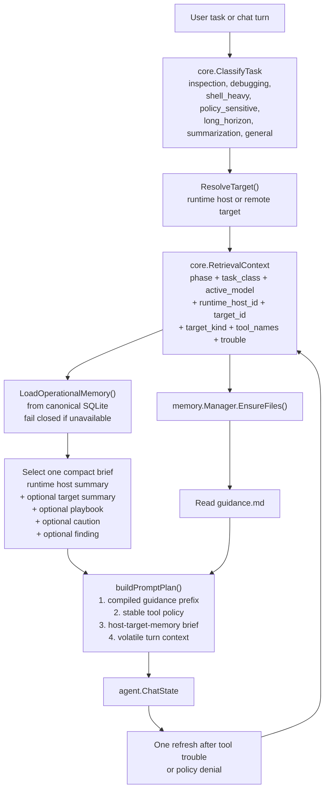
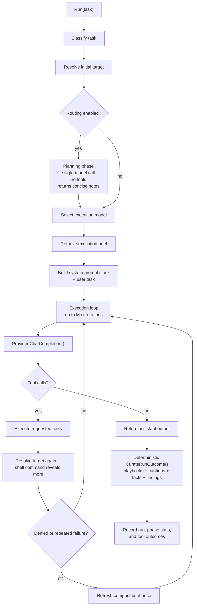
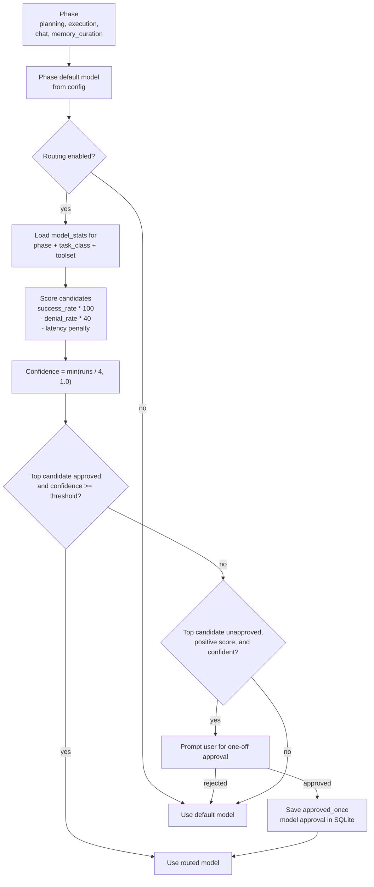
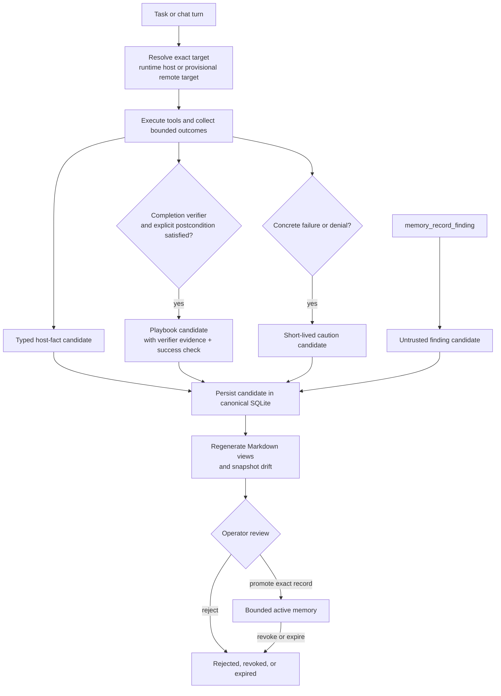
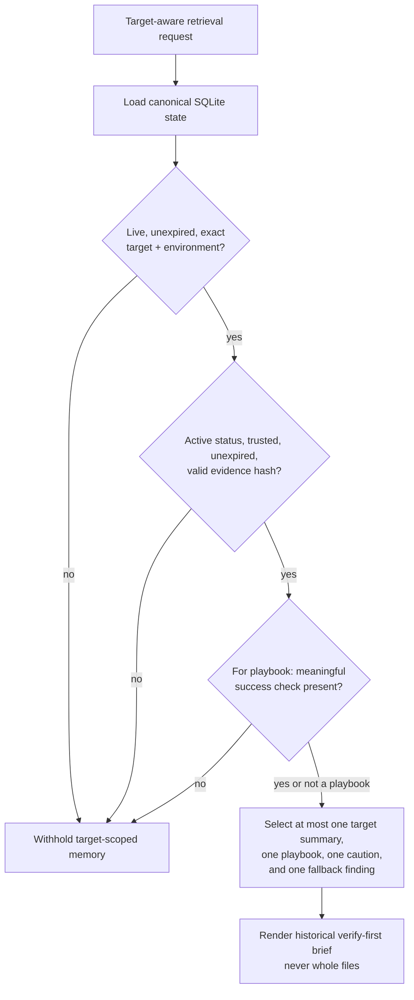
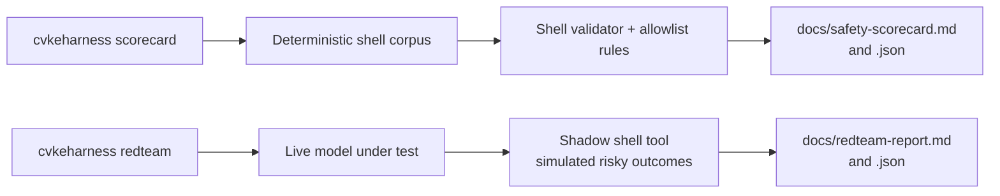

# CvkeHarness Visual Guide

This guide is a companion to:

- [README.md](../README.md)
- [memory-model.md](memory-model.md)
- [architecture.md](architecture.md)

It focuses on the parts of the project that matter most when you are trying to rebuild the mental model quickly:

- context management
- the agent loop
- model routing
- target-aware memory
- safety and evaluation

## 1. System At A Glance



Key idea: the CLI builds one runtime from config, provider, router, tool registry, memory manager, and SQLite state, then hands control to `agent.Agent`.

The runtime keeps two persistence roles distinct:

- `guidance.md` for user-authored prompt context plus generated Markdown views for operator inspection and explicit validated import
- SQLite for canonical operational memory, routing stats, exact action grants, chat history, and runtime records

## 2. Context Management

The project does not build one giant prompt. It assembles context in layers and keeps the retrieved part small.



What matters here:

- `builtInRules()` is fixed runtime policy and keeps baseline behavior stable
- `guidance.md` is the user-authored operating surface
- retrieval is structured-first, not semantic-first
- the runtime host and the active target are modeled separately
- mid-run refresh is allowed once after tool trouble so the model can see a tighter brief for the failing target/tool

## 3. Agent Loop

`agent.Agent` is the center of gravity for the project.



Key details:

- planning is optional and tool-free
- execution is iterative and tool-driven
- target identity can tighten mid-run after observed `ssh`, `scp`, or `rsync` commands
- the default runtime now curates memory deterministically from observed outcomes rather than asking a model to invent durable structure

## 4. Model Routing

Routing is local, heuristic, and approval-aware. It is not an unconstrained auto-router.



The route profile is more specific than just "best model overall". It keys off:

- phase
- task class
- toolset

That means a model can be preferred for execution on debugging tasks with `shell_execute`, while another model still wins for planning or chat.

## 5. Operational Memory Lifecycle

Memory is target-aware, canonical in SQLite, and review-gated.



Important behaviors:

- remote targets begin with `environment=unknown` and cannot contribute retrievable memory until an operator binds environment and remote identity labels
- all model-, tool-, and probe-derived records begin as candidates
- exit code zero alone does not produce a promotable playbook; verifier evidence and a meaningful success check are required
- candidates never enter prompts before explicit promotion
- generated Markdown is not a runtime fallback authority

## 6. Retrieval Gates

The retrieval system deliberately favors fail-closed precision over breadth.



Candidate, rejected, revoked, expired, untrusted, wrong-environment, and tampered records are excluded from every injection path, including target summaries. There is no direct-use mode.

## 7. Safety Model

Safety is not just one guard. It is a stack of boundaries around shell access plus separate evaluation commands.

```mermaid
flowchart TD
    call["Model requests shell_execute"]
    parse["Parse command and\nclassify concrete effects"]
    policy["Evaluate immutable security policy\ndeny > ask > llm_review > allow"]
    blocked["Deny or malformed action"]
    judge["Optional advisory LLM review\nnever authority"]
    user["Human approval\nexact action + effects + policy +\nhost + principal + working directory"]
    grant["Process-local exact grant or\n15-minute atomic single-use\nsecurity_action_grant"]
    exec["Run sh -c with timeout\ncapture and stream output"]
    events["Emit structured events\nand telemetry"]

    call --> parse --> policy
    policy -- "deny" --> blocked
    policy -- "allow" --> exec --> events
    policy -- "llm_review" --> judge --> user
    policy -- "ask" --> user
    user -- "reject" --> blocked
    user -- "approve exact action" --> grant --> exec
```

The separate safety commands then evaluate those rails from two angles:



## 8. Practical Mental Model

If we compress the whole codebase into one sentence, it is this:

CvkeHarness is a phase-routed tool-using LLM runtime whose behavior is shaped by a layered prompt stack, effect-aware safety rails, exact scoped grants, and compact target-aware operational memory that is canonical in SQLite and exposed through generated views.

If you want to re-enter the code quickly, this is the best reading order:

1. `cmd/run.go`
2. `agent/agent.go`
3. `memory/manager_retrieval.go`
4. `memory/manager_persist.go`
5. `tools/shell.go`
6. `state/store.go`
7. `state/store_operational_memory.go`
8. `safety/scorecard.go` and `safety/redteam.go`
