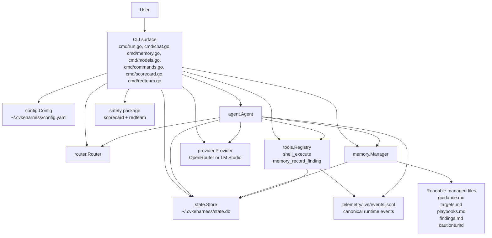
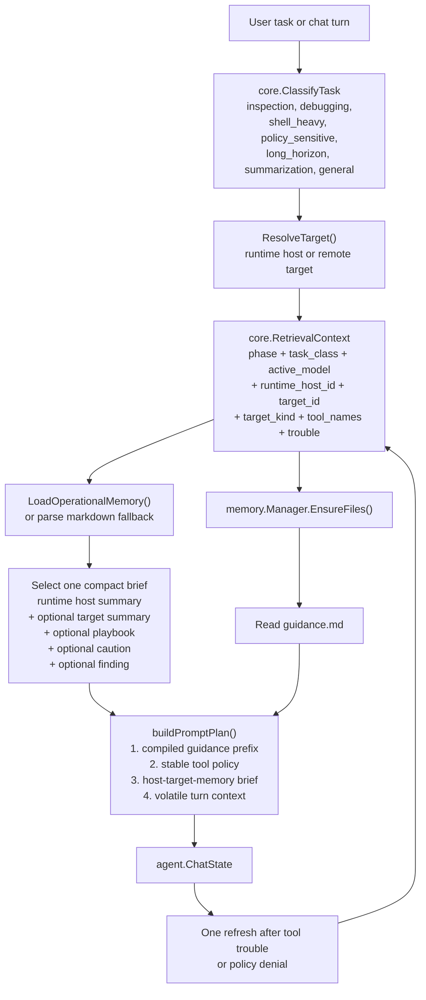
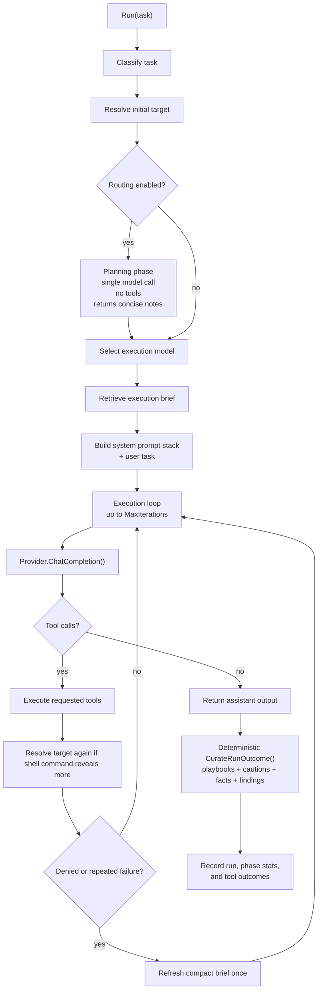
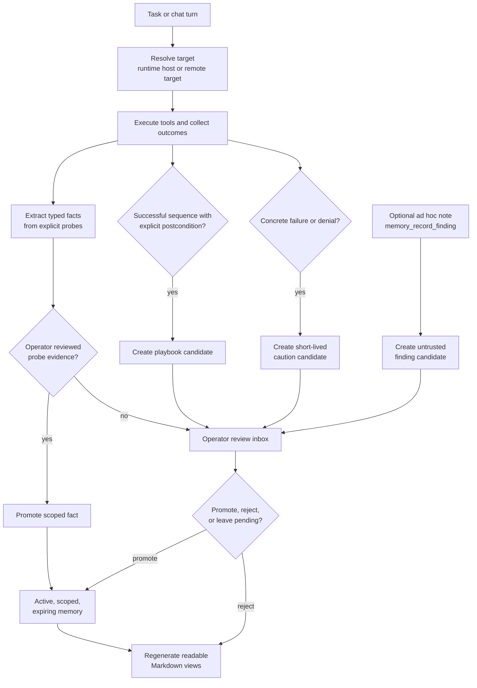
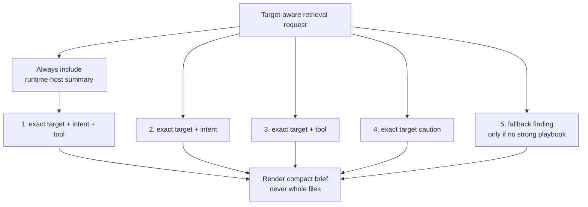
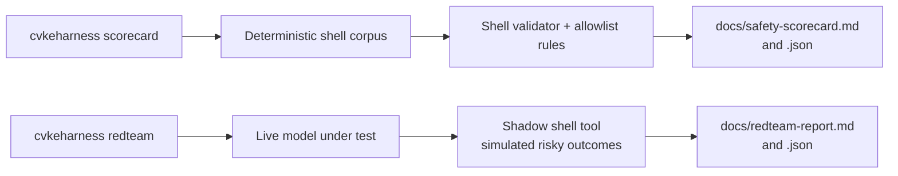

# CvkeHarness Visual Guide

This guide is a companion to:

- [README.md](../README.md)
- [memory-model.md](memory-model.md)
- [architecture.md](architecture.md)

It focuses on the parts of the project that matter most when you are trying to rebuild the mental model quickly:

- context management
- the agent loop
- model routing
- target-aware memory
- safety and evaluation

## 1. System At A Glance



Key idea: the CLI builds one runtime from config, provider, router, tool registry, memory manager, and SQLite state, then hands control to `agent.Agent`.

The runtime is intentionally split into two worlds:

- readable files for durable operator understanding
- SQLite for routing stats, approvals, indexing, chat history, and operational memory lookup

## 2. Context Management

The project does not build one giant prompt. It assembles context in layers and keeps the retrieved part small.



What matters here:

- `builtInRules()` is fixed runtime policy and keeps baseline behavior stable
- `guidance.md` is the user-authored operating surface
- retrieval is structured-first, not semantic-first
- the runtime host and the active target are modeled separately
- mid-run refresh is allowed once after tool trouble so the model can see a tighter brief for the failing target/tool

## 3. Agent Loop

`agent.Agent` is the center of gravity for the project.



Key details:

- planning is optional and tool-free
- execution is iterative and tool-driven
- the endpoint label can tighten mid-run after observed `ssh`, `scp`, or `rsync` commands
- the default runtime now curates memory deterministically from observed outcomes rather than asking a model to invent durable structure

## 4. Model Routing

Routing is local, heuristic, and approval-aware. It is not an unconstrained auto-router.


The route profile is more specific than just "best model overall". It keys off:

- phase
- task class
- toolset

That means a model can be preferred for execution on debugging tasks with `shell_execute`, while another model still wins for planning or chat.

## 5. Operational Memory Lifecycle

Operational memory is target- and environment-scoped planning context. It is separate from managed policy and command authorization.



Important behaviors:

- SQLite is canonical; Markdown files are generated views and explicit import sources
- targets require a deterministic endpoint-label ID, environment, and operator-confirmed remote identity label before active memory can support planning
- endpoint labels are not live machine fingerprints; the operator still verifies the endpoint before mutation
- model-authored notes, successful command sequences, and failure text enter the review inbox as untrusted candidates
- typed facts from explicit probes remain candidates until operator review; probe output cannot silently rewrite target identity
- playbooks require a success check before promotion, and every retrieved playbook remains a historical verify-first hint
- `memory_record_finding` cannot create policy, approvals, credentials, host mappings, or active memory

## 6. Retrieval Priorities

The retrieval system deliberately favors precision over breadth.



Freshness buckets:

- `fresh`
- `stale`
- `cold`

Rendering behavior:

- active, unexpired, integrity-valid records are considered only for an exact target and environment match
- every playbook renders as a historical verify-first hint
- candidate, rejected, revoked, expired, tampered, and unrelated target memory does not enter the brief

## 7. Safety Model

Safety is not just one guard. It is a stack of boundaries around shell access plus separate evaluation commands.

```mermaid
flowchart TD
    call["Model requests shell_execute"]
    parse["ParseShellCommand()\nsegment command\nreject blocked syntax"]
    blocked["Blocked syntax\nredirection, substitution,\nbackticks, raw newlines,\nsingle &, malformed chains"]
    allow["Allowlist, same-session approval,\nor explicit CLI exception?"]
    gate["Secondary approval gate"]
    judge["LLM judge\nSAFE or DANGEROUS"]
    user["User confirm\nreject, approve once,\napprove and remember"]
    session{"Exact session ID\npresent?"}
    remember["Persist same-session approval\ninto scoped_command_approvals"]
    exec["Run sh -c with timeout\ncapture and stream output"]
    events["Emit structured events\nand telemetry"]

    call --> parse
    parse -- "invalid" --> blocked
    parse -- "valid" --> allow
    allow -- "yes" --> exec --> events
    allow -- "no" --> gate
    gate --> judge
    gate --> user
    judge --> exec
    user --> session
    session -- "yes, remember" --> remember
    session -- "no or approve once" --> exec
    remember --> exec
```

The separate safety commands then evaluate those rails from two angles:



## 8. Practical Mental Model

If we compress the whole codebase into one sentence, it is this:

CvkeHarness is a phase-routed tool-using LLM runtime whose behavior is shaped by a layered prompt stack, approval-aware safety rails, and a compact target-aware operational memory system backed by readable markdown and SQLite indexing.

If you want to re-enter the code quickly, this is the best reading order:

1. `cmd/run.go`
2. `agent/agent.go`
3. `memory/manager_retrieval.go`
4. `memory/manager_persist.go`
5. `tools/shell.go`
6. `state/store.go`
7. `state/store_operational_memory.go`
8. `safety/scorecard.go` and `safety/redteam.go`
